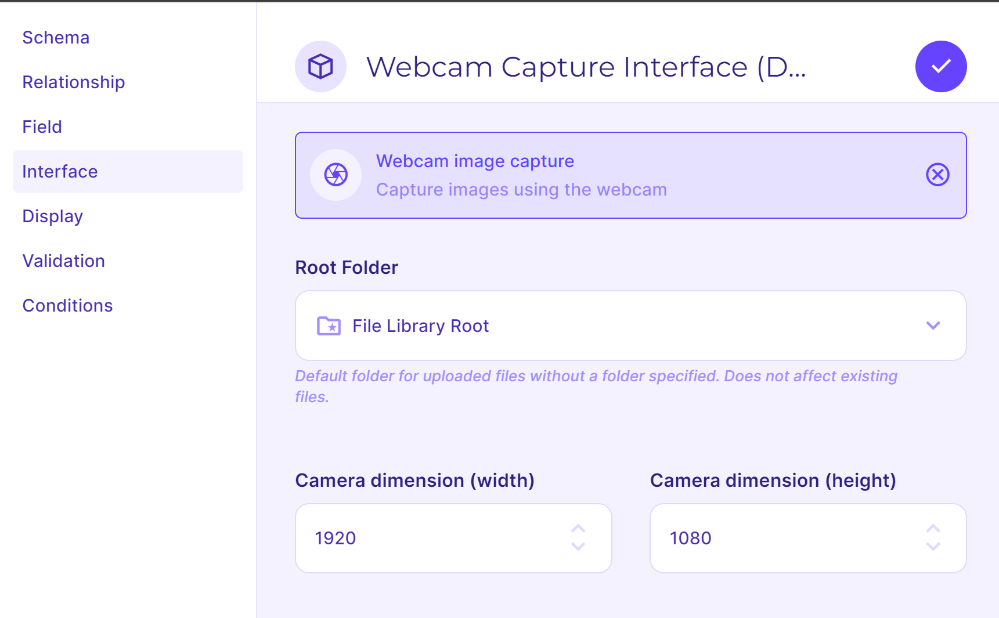
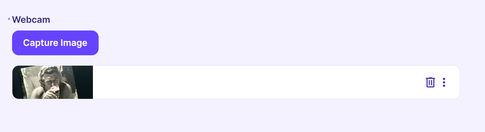
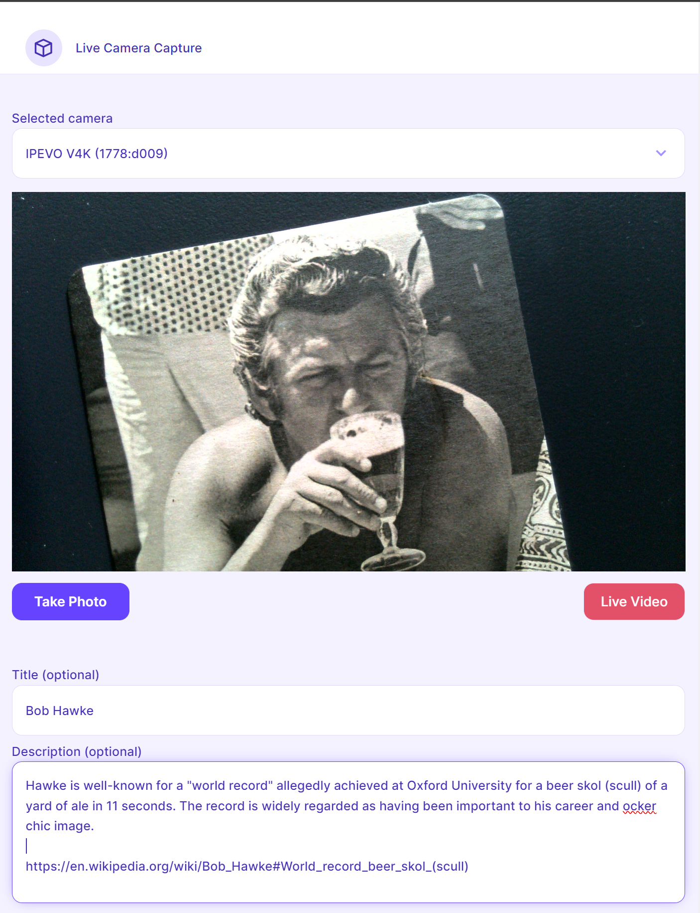

# Webcam Capture Interface

Webcam Capture Interface is a [Directus](https://directus.io) extension to capture one or more images using a device webcam.

- Uses `Multiple files` field
- Capture images from a live webcam
- Basic image metadata input fields capture and editing (`name` and `description`)
- UI to request camera permissions
- previous camera selection stored to localstorage
- Live and saved UI
- User configurable options
  - Root folder - set the default folder for image uploads
  - Camera dimensions - set the device image resolution

### Screngrabs

<figure>
    <figurecaption>Entrypoint</figurecaption>
    
</figure>
<figure>
    <figurecaption>Image listing</figurecaption>
    
</figure>
<figure>
    <figurecaption>Live video capture</figurecaption>
    
</figure>

### TODO

- abilty to zoom into image in live view and capture at set resolution
- add semantic commit
- auto semver
